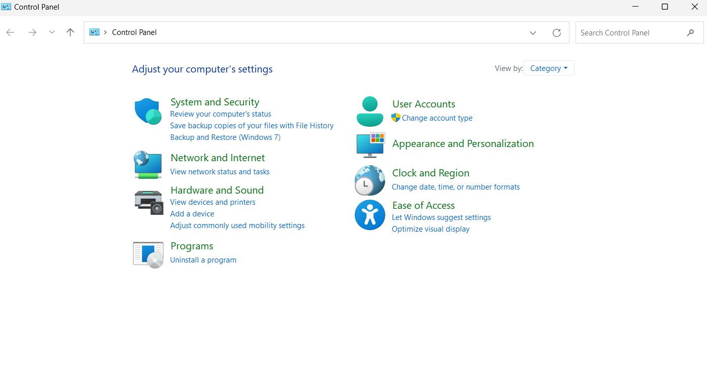
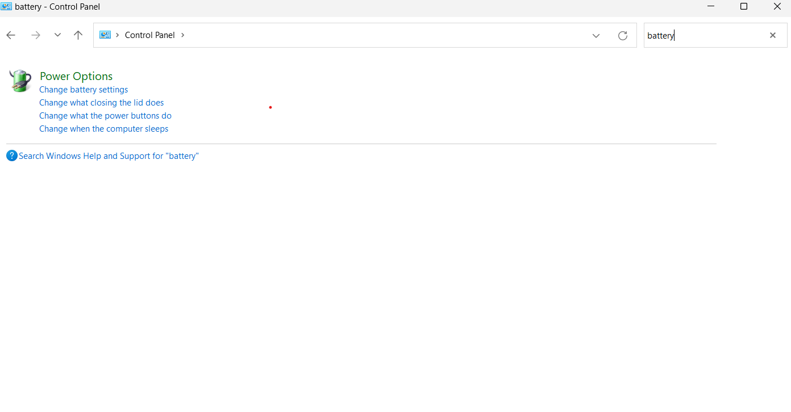
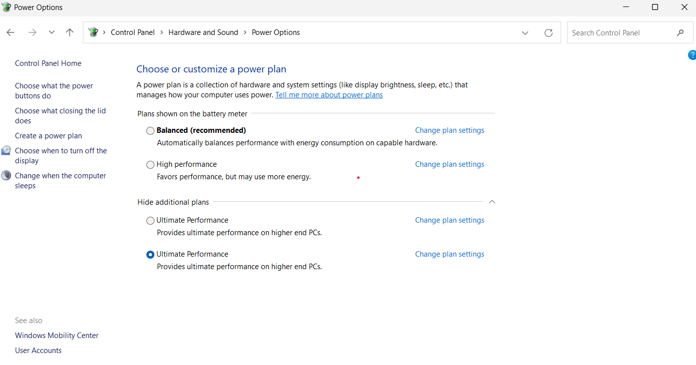

# COLLECTION OF APPS COMMAND THAT MIGHT BE HELPFUL FOR YOU...

## <ins>I0Bit uninstaller and I0Bit driver booster</ins>

1. Both app are developed by the IoBit 
2. I0Uninstaller helps you to clear/uninstall the app from its core.
3. I0Driver booster helps you to update the driver and outdated software.
 
 

## <ins>POWERSHELL COMMAND TO ACTIVATE WINDOWS AND OFFICE...</ins>

1. OPEN POWERSHELL IN YOUR PC/LAPTOP 
 

2. THEN AFTER PASTE THIS CODE ON IT     

    
            irm https://massgrave.dev/get |iex
    
    
    

1. THEN A POPUP BOX WILL APPEAR AS WINDOWS COMMAND PROCESSOR. ALLOW "YES"
 

4. SELECT THE OPTION YOU WANT TO ACTIVATE.

    DONE.

##<ins>CHECK UR SSD/HDD HEALTH .</ins>

Download the crystaldiskinfo exe file on your computer/laptop 
Then install the file.

    Launch the app.     GG

## <ins> Network Problem On ur laptop/computer </ins>

Open the Command Prompt as an administrator and paste the code then hit ENTER:
 
 1. Clear DNS Cache:
    
             ipconfig /flushdns

2. Reset Winsock:
    
             netsh winsock reset

3. Optimize Network Settings :   
    
              netsh int tcp set global autotuninglevel=normal

4. Flush DNS and Renew IP:

               ipconfig /release

               ipconfig /renew        

## <ins> Ultimate Performance CMD COMMAND FOR LAPTOP:</ins>

Open the Command Prompt as an administrator and paste the code the hit ENTER:

 1. ***ULTIMATE PERFORMANCE:***

            powercfg -duplicatescheme e9a42b02-d5df-448d-aa00-03f14749eb61

2. Open control panel .Then search for battery/poweroption.

3. Select the ultimate performance.
    

4. ***Press*** win + R the search for 

    - TEMP
    - %TEMP
    - prefetch

 ***<ins>Open cmd as administrator.</ins>***
5. Disk Cleanup.
 
        cleanmgr

6. Disk Check.

            chkdsk/r

7. System File Checker.

             sfc /scannow

8. Check for virus 

WIN + R on keyboard

        mrt 

Then choose the option u want to scan ..

#### "REMOVE ALL THE FILE FROM" OR "SIMPLY PRESS CTRL + A THEN SHIFT + DEL" .PRESS OK.

## <ins>CMD COMMAND TO UPGRADE ALL THE DRIVER AND SOFTWARE:</ins>

1. CODE.
           
            winget upgrade --all

