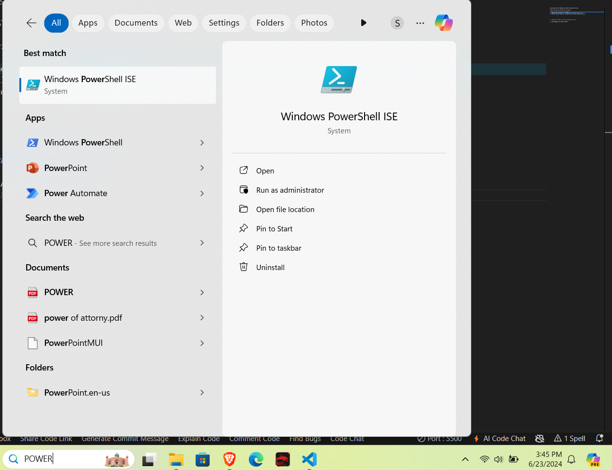
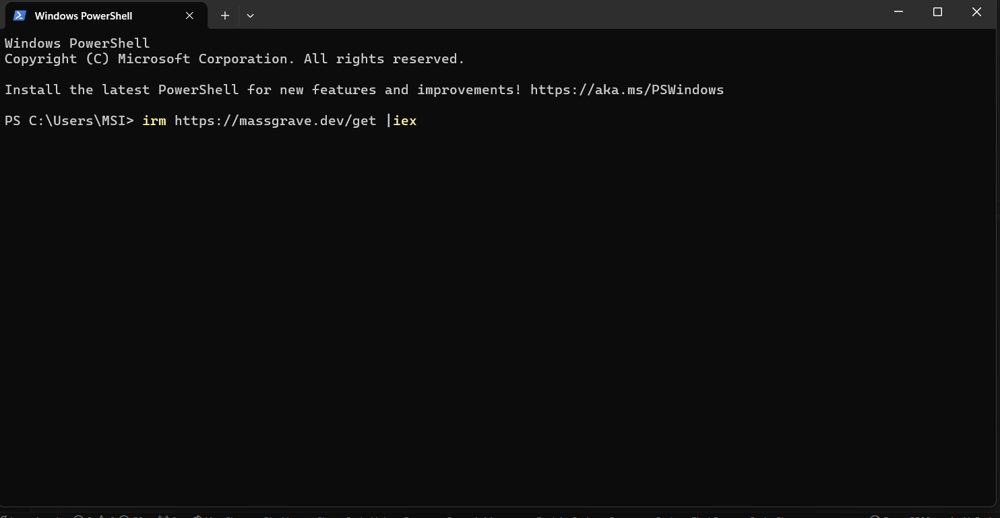
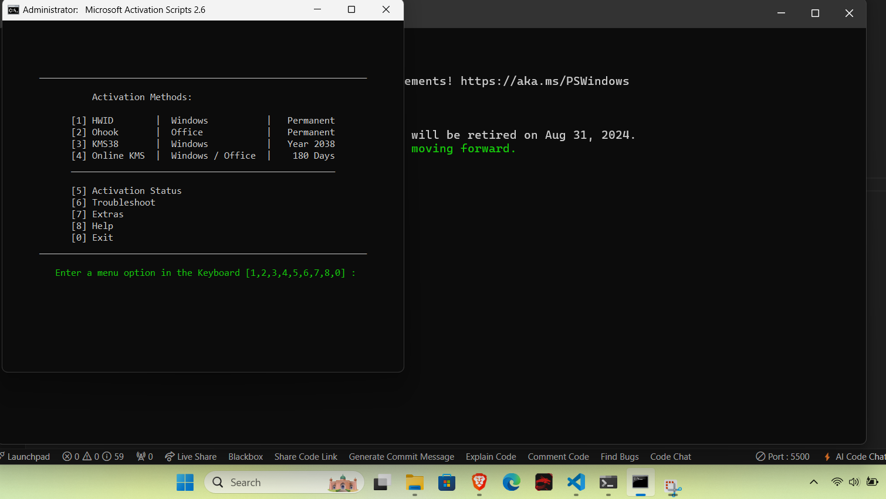

# COLLECTION OF APPS COMMAND THAT MIGHT BE HELPFUL FOR YOU...

## IoBit uninstaller and IoBit driver booster

1. Both app are developed by the IoBit 
2. IoUninstaller helps you to clear/uninstall the app from its core.
3. IoDriver booster helps you to update the driver and outdated software.
 
 

## POWERSHELL COMMAND TO ACTIVATE WINDOWS AND OFFICE...

1. OPEN POWERSHELL IN YOUR PC/LAPTOP 
 

2. THEN AFTER PASTE THIS CODE ON IT     

    
            irm https://massgrave.dev/get |iex
    
    
    

1. THEN A POPUP BOX WILL APPEAR AS WINDOWS COMMAND PROCESSOR. ALLOW "YES"
 

4. SELECT THE OPTION YOU WANT TO ACTIVATE.

    DONE.

## CHECK UR SSD/HDD HEALTH .

Download the crystaldiskinfo exe file on your computer/laptop 
Then install the file .